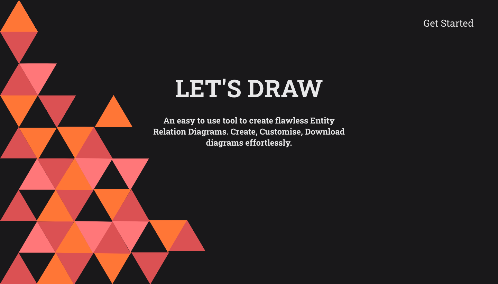
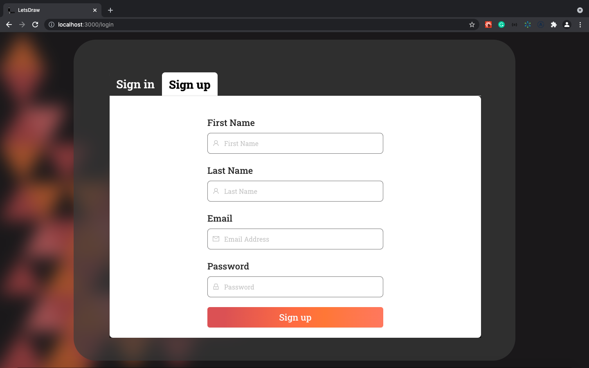
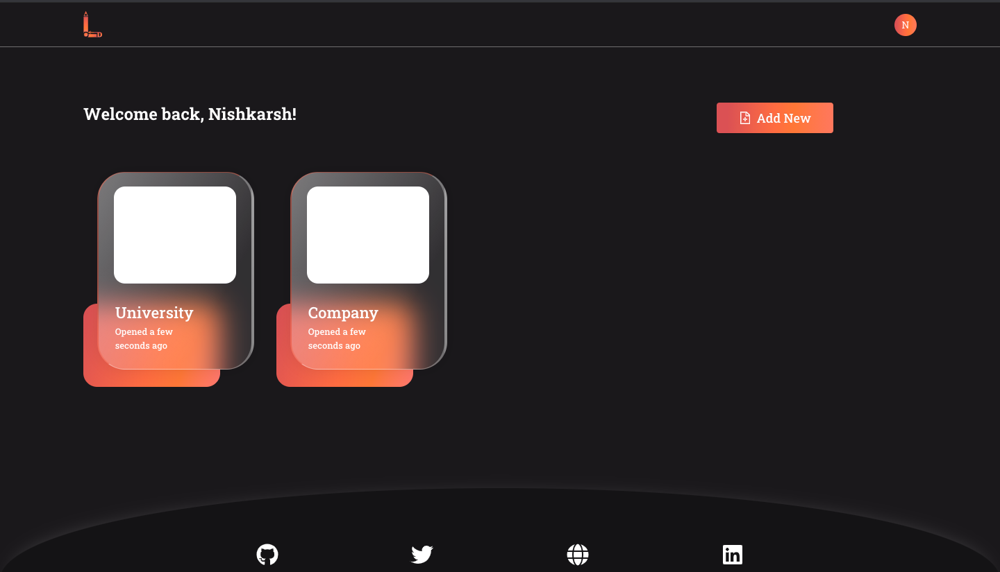
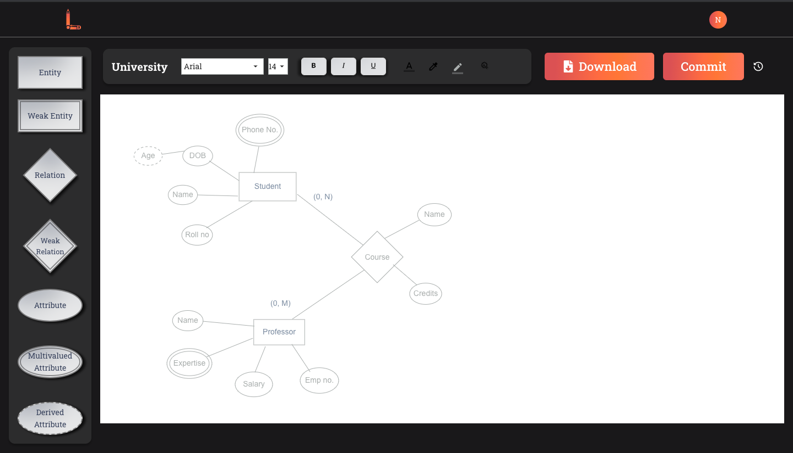
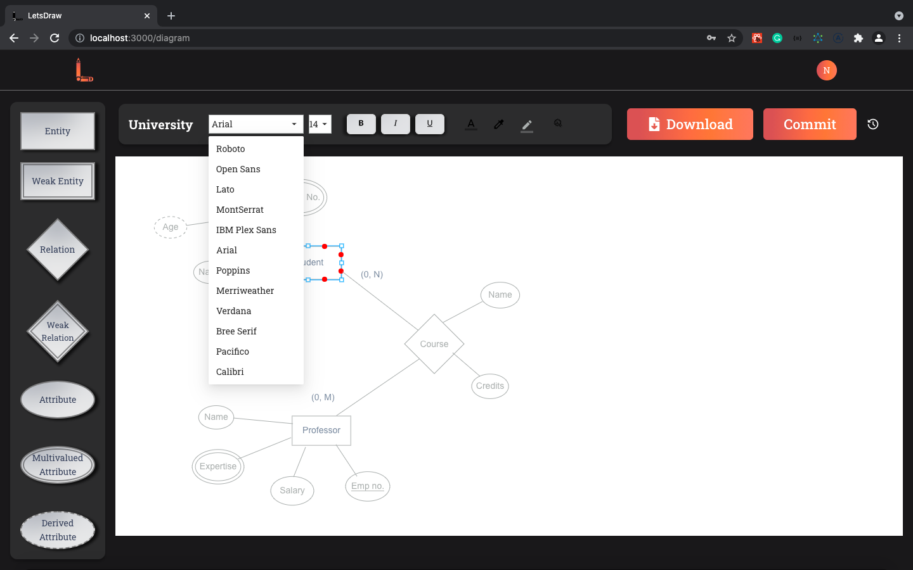
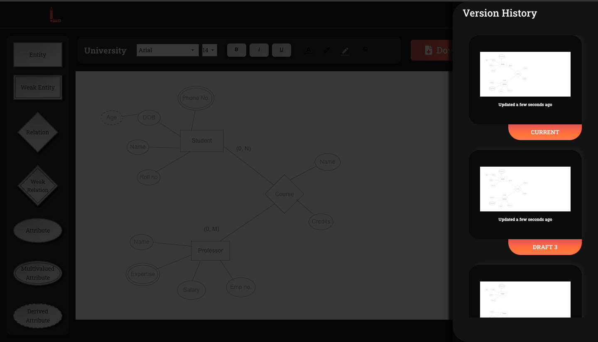
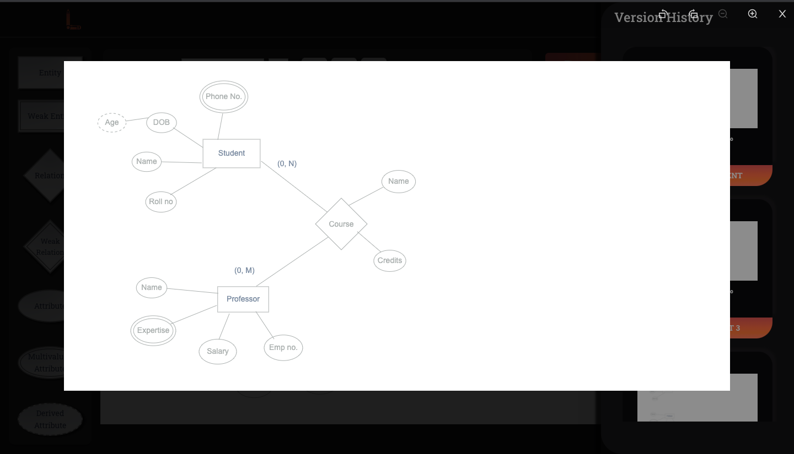
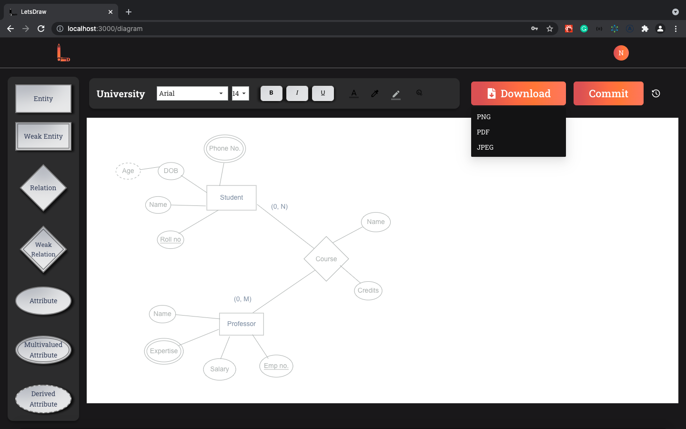

## Lets Draw

A browser based tool to facilitate drawing of Entity Relationship Diagrams (ERD). Coupled with a REST API, provides a complete means of creating, storing, versioning and sharing ERD.

### Sample Working

#### Home Page

#### User Signup Page

#### User Dashboard

#### ERD Page

#### Diagram Customization

#### Diagram Versioning

#### Version Previews

#### Diagram Exporting

